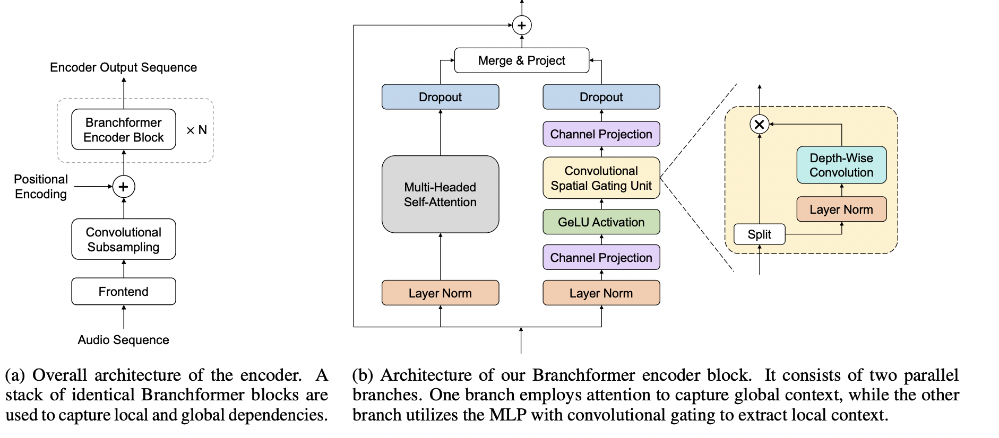
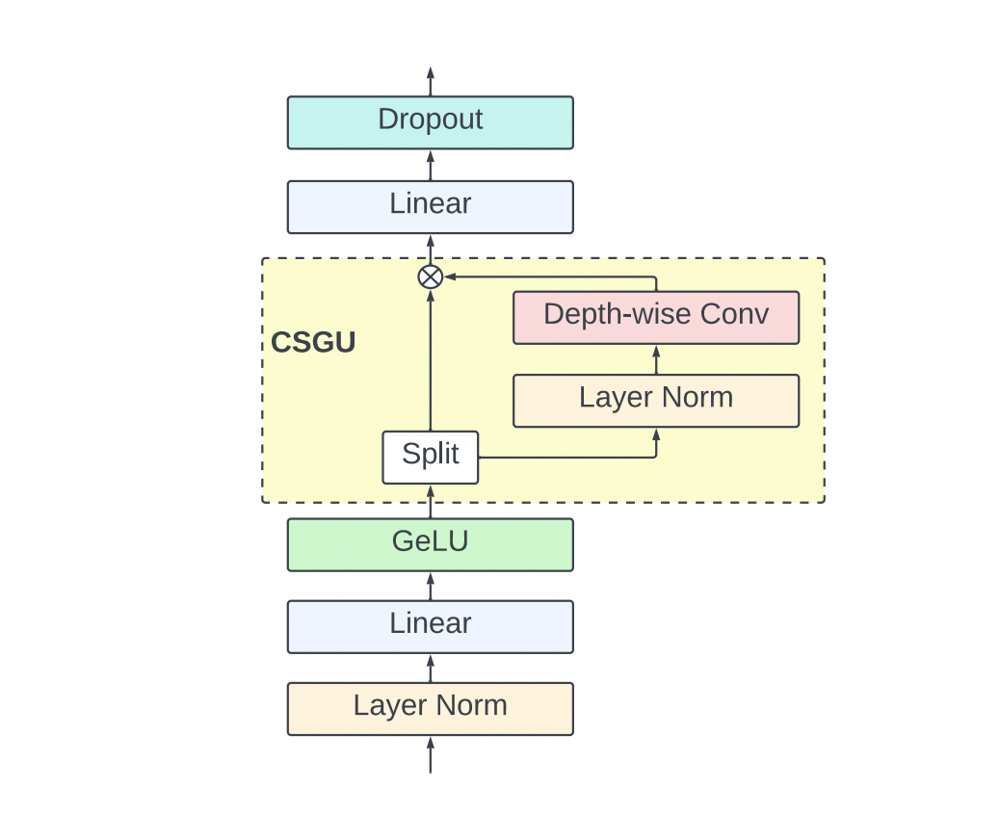
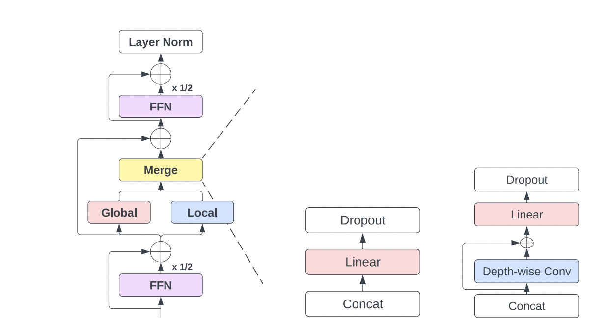
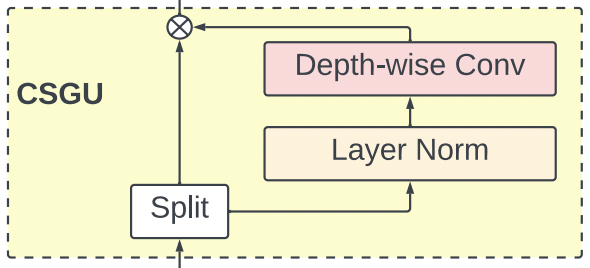
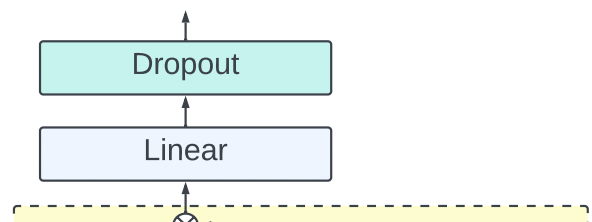
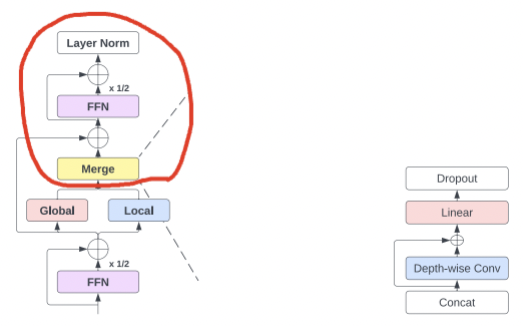

# Branchformer + E-branchformer

[https://arxiv.org/pdf/2207.02971,](https://arxiv.org/pdf/2207.02971) [https://arxiv.org/pdf/2210.00077](https://arxiv.org/pdf/2210.00077)

Авторы статьи **Brancformer** предлагают новую архитектуру для энкодеров ASR-моделей.

Как и конформер, она использует свертки для получения “local dependencies” и аттеншн для получения “global dependencies”, но, в отличии от конформера, явно разделяет каждый слой на 2 ветки, каждая из которых излвекает только один тип зависимости.

Авторы следующей статьи, **E-Brancformer,** улучшают архитектуру **Brancformer-а,** добавляя в него macaron-style ffn и изменяя модуль объединения глобальных и локальных фичей.

Получившаяся архитектура в сравнении с **Conformer-**ом показывает более высокое качество в Speech-задачах ([статья про сравнение конформера и ебранчформера](https://www.isca-archive.org/interspeech_2023/peng23b_interspeech.pdf)), и, как отмечают исследователи в других статьях ([OWSM](https://arxiv.org/pdf/2401.16658), [XEUS](https://arxiv.org/abs/2407.00837)), является более стабильной для обучения больших моделей.

## Branchformer

- Энкодер состоит из сабсэмплинга + настаканных слоев
- Слой представляет из себя 2 ветки и модуль объединения:
    - **Global extractor** — стандартное извлечение global-зависимостей с помощью MultiHeadedAttention
    - **Local exctactor**  — извлечение local-зависимостей с помощью линейных проекций и модуля **Convolutional Spatial Gating**
        
        Этот модуль впервые предложили для решения СV-задач ([Convolutional Gated MLP](https://arxiv.org/pdf/2111.03940))
        
        Линейный гейтинг - стандартная практика в нейронках. Здесь же к нему добавили Depth-wise свертку т.к. свертки работают лучше линейных слоев в CV и Speech-задачах.
        
        
        
- Merge-модуль — используется для объединения эмбеддингов из двух веток. В оригинальной статье про Branchformer авторы использовали взвешенное суммирование либо конкатенацию с последующей проекцией.

## E-Branchformer

Авторы E-branchformer предложили небольшие улучшения в архитектуру branchformer-а.

- Добавили FeedForwardNetwork, как в конформере
- Исследовали различные варианты улучшения модуля объединения, остановились на добавлении в него Depth-Wise свертки.

Для полного понимания распишем работу E-Branchformer слоя формулами:

- Получаем на вход эмбеддинги  $E$ размерностью $(B, T, C)$, где измерения соответствуют размеру батча, числу эмбеддингов и их размерности.
    
    Также на вход приходит тензор длин эмбеддингов (т.к. в батче они паддятся до максимальной длины). Этот тензор надо будет использовать для создания attention-маски.
    
- Прогояем их через `FeedForward` + residual

$$
E = E + 0.5 *FFN(E)
$$

- Клонируем получившиеся эмбеддинги и прогоняем их через 2 ветки:
    - **Attention branch**
        
        Здесь делаем `LayerNorm` и `MultiheadAttention` :
        
        $$
        E_{global} = MHA(LayerNorm(E), Mask),
        $$
        
        где $Mask$ - паддинг-маска, которую мы создали из пришедшего на вход вектора эмбеддингов
        
    - **cgMLP branch**
        
        
        
        - Делаем нормализацию, проекцию и активацию:
            
            $$
            E_{local} = GeLU(Linear(LayerNorm(E)))
            $$
            
            Здесь проекция делается из размености модели в размерность cgMLP-слоя. В конфиге модели задается `expansion_factor` , который показывает во сколько раз эта размерность больше размера модели.
            
        - Затем идет `ConvolutionalSpatialGatingUnit`-модуль: делим наши эмбеддинги на 2 части по размерности каналов, прогоняем второй из них через нормализацию и свертку и затем перемножаем их поэлементно:
            
            
            
            $$
            E_1 = E_{local}[:,:,0:\frac{n\_channels}{2}]
            $$
            
            $$
            E_2 = E_{local}[:,:,\frac{n\_channels}{2}:n\_channels]
            $$
            
            $$
            E_2 = DepthWiseConv(LayerNorm(E2))
            $$
            
            $$
            E_{local} = E_1 \cdot E_2
            $$
            
        - После этого делаем еще одну проекцию — обратно в размерность модели:
            
            
            
            $$
            E_{local} = Linear(E_{local})
            $$
            
        
        Готово, **cgMLP branch** прогнали
        
    
- Последний этап вычислений в слое - объединение $E_{local}$ и $E_{global}$, применение residual с эмбеддингами до веток и прогон через еще один `FeedForward` - слой:
    
    
    
    $$
    E_{merged} = [E_{global}, E_{local}]
    $$
    
    $$
    E_{merged} = Linear(E_{merged} + DepthWiseConv(E_{merged}))
    $$
    
    $$
    E = E + E_{merged}
    $$
    
    $$
    E = LayerNorm(E + 0.5 * FFN(E))
    $$